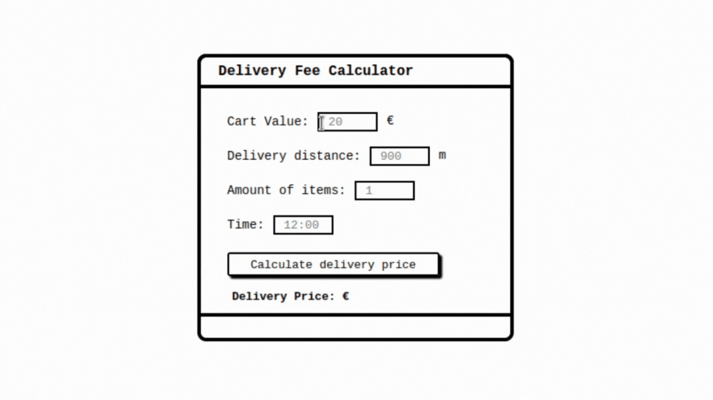

# 🚚 Delivery Calculator

<p align="center">This project simulates a fictitious freight calculator, where we enter the final value of the cart, delivery distance, number of items in the cart and the time the order is placed.</p>

📑 Table of Contents
=================
<!--ts-->
   * 🚚 [Sobre](#🚚-delivery-calculator)
   * 📑 [Table of Contents](#📑-table-of-contents)
   * 💡 [Pre-requisites](#💡-pre-requisites)
   * 🎲 [Running the Back End (server)](#🎲-running-the-back-end)
   * 🖥 [Running the Front End (web/user)](#🖥-running-the-front-end)
   * 🛠 [Technologies](#🛠-technologies)
   * 👨‍💻 [Author](#👨‍💻-author)
<!--te-->

<h4 align="center"> 
	✅  Django + ReactJS 🚀 Finished  ✅
</h4>

<h1 align="center">
  
</h1>

### 💡 Pre-requisites

Before starting, you will need to have the following tools installed on your machine:
[Git](https://git-scm.com), [Python](https://www.python.org/), [Python-pip](https://pypi.org/project/pip/). 

Also it's nice to have an editor to work with the code like [VSCode](https://code.visualstudio.com/)


### 🎲 Running the Back End

```bash
# Clone this repository
$ git clone <https://github.com/HassanOliveira/DeliveryCalculator-Django-ReactJS>

# Access project folder in terminal/cmd
$ cd DeliveryCalculator-Django-ReactJS

# Go to backend folder
$ cd backend

# Create a development environment to install the dependencies
$ python3 -m venv venv

# Access the created development environment
$ source YOUR_PATH/DeliveryCalculator-Django-ReactJS/backend/venv/bin/activate

# Install the dependencies
$ pip install -r requirements.txt

# Run the project
$ python3 manage.py runserver
```

### 🖥 Running the Front End
```bash
# Open another terminal and go to frontend folder
$ cd frontend

# Install the npm
$ npm install

# Run the project
$ npm start
```

### 🛠 Technologies

The following tools were used in building the project:

- [React](https://reactjs.org/)
- [Django](https://www.djangoproject.com/)

### 👨‍💻 Author

<a href="http://www.devhbo.com">
 
 <br />
 <sub><b>Hassan Bittencourt</b></sub></a> <a href="http://www.devhbo.com" title="Hassan Bittencourt">🚀</a>


Made with ❤️ by Hassan Bittencourt 👋🏽 Contact me!

[](https://www.linkedin.com/in/hassanaboliveira/)
[](mailto:hassan_bittencourt@hotmail.com)
